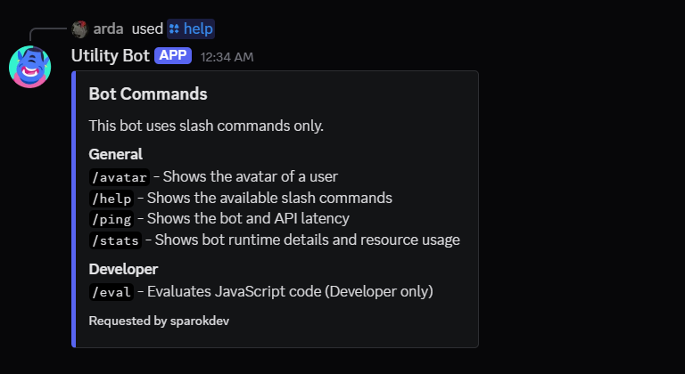
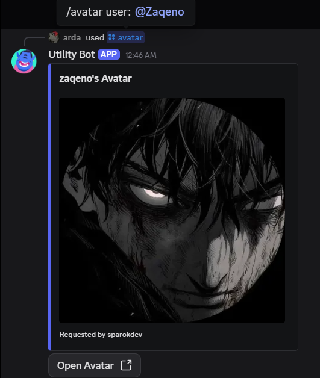
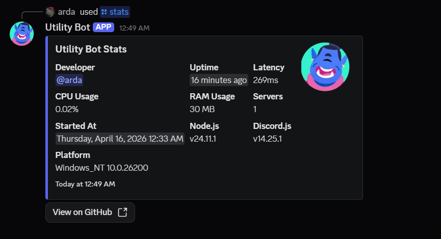
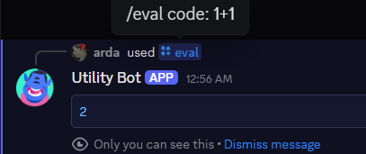

# BotTemplate

BotTemplate is a fully slash-command Discord.js v14 starter bot focused on a clean structure, categorized commands, and easy customization.
It keeps the setup simple, uses a single `app.js` entry file, and includes practical starter commands such as `/help`, `/ping`, `/avatar`, `/stats`, and a developer-only `/eval`.

## Highlights

- Slash commands only
- Discord.js v14 architecture
- Categorized command folders
- Global command deployment with `npm run deploy`
- Runtime stats command with CPU, RAM, uptime, developer, and version details
- Avatar command with direct image button
- Developer-only eval command
- Simple configuration through `config.json`

## Commands

### General

- `/help`
  Shows the available command groups.

- `/ping`
  Shows gateway latency and round-trip time.

- `/avatar`
  Shows your avatar or another user's avatar.

- `/stats`
  Shows bot runtime details such as CPU usage, RAM usage, uptime, latency, developer info, platform, and version data.

### Developer

- `/eval`
  Evaluates JavaScript code and is limited to the configured developer ID.

## Visual Walkthrough

### 1. Help Menu



This screenshot should show `/help` returning the categorized command list with the General and Developer sections visible.

### 2. Avatar Command



This screenshot should show `/avatar` with the embed image fully visible and the `Open Avatar` button under it.

### 3. Stats Command



This screenshot should show `/stats` with the embed fields visible, especially CPU Usage, RAM Usage, Uptime, Developer, and the GitHub button.

### 4. Eval Command



This screenshot should show a safe sample `/eval` run in a developer account, ideally with a tiny expression like `1 + 1`.

## Screenshot Guide

Use Discord desktop in a clean test server and keep the same theme for every shot so the README feels consistent.

Recommended captures:
- `01-help-menu.png`: run `/help` and expand the full embed so both categories are readable
- `02-avatar-command.png`: run `/avatar` on a user with a clear avatar and keep the full image preview in frame
- `03-stats-command.png`: run `/stats` a few minutes after startup so uptime, CPU, and RAM values look realistic
- `04-eval-command.png`: run `/eval code: 1 + 1` from the developer account and keep only the result block visible

Tips:
- Use a dedicated test server with no distracting channels in the sidebar
- Keep Discord zoom around 100% so fields stay readable
- Crop tightly around the command response
- Hide private server names, user DMs, or tokens before saving screenshots
- Save the images into `assets/screenshots/` with the exact filenames above

## Configuration

Edit `config.json` before starting the bot.

```json
{
  "token": "YOUR_BOT_TOKEN",
  "clientId": "YOUR_CLIENT_ID",
  "developerId": "YOUR_DISCORD_USER_ID"
}
```

## Installation

1. Install dependencies:

```bash
npm install
```

2. Fill `config.json` with your real values.

3. Deploy slash commands:

```bash
npm run deploy
```

4. Start the bot:

```bash
npm start
```

Optional local starter:

```bat
start.bat
```

Optional validation:

```bash
npm run check
```

## Required Bot Permissions

The bot should have at least these permissions:

- View Channels
- Send Messages
- Use Slash Commands
- Send Messages in Threads
- Embed Links

## Logging

Startup logs are intentionally plain.
Examples:

- `Loaded command: help [General]`
- `Loaded client events.`
- `Successfully deployed global slash commands.`
- `Bot ready: YourBotName#0000`

## Slash Command Registration

Application commands are registered globally through `npm run deploy`.
Discord may take a short time to refresh global slash commands after deployment.

## Project Structure

```text
app.js
config.json
start.bat
assets/
  screenshots/
src/
  commands/
    developer/
    general/
  events/
  handlers/
  utils/
```

## License

This project is released under the MIT License.
